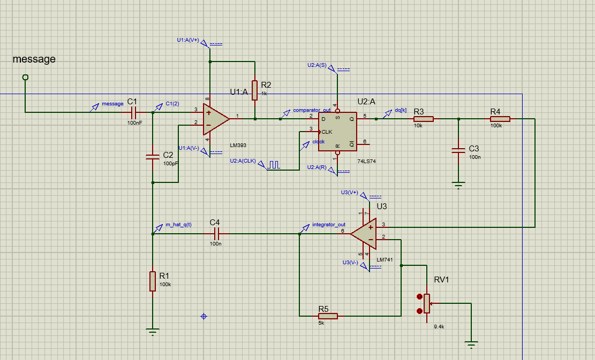

# Designing-a-Communication-System-Based-on-Delta-Modulation
Implemented in Proteus

This project can be divided into following modules
-   Modulation
-   Transmission through noisy channel
-   Demodulation
-   Noise Analysis

 

## **Circuit Diagram**
 

   

   
## **Modulation**
It consists of 3 blocks
-   Comparator
-   D Flip-Flop
-   Feedback Integrator

 

   

   

After passing these 3 blocks, the output signal looks like following
 

   

   

## **Noise & Summing Block**
-   Noise is added to make realistic.
-   5 random sinusoid(500,800,1700,2300,3500 Hz)
-   Summing amplifier

 

   

   

After adding random noise, the output signal looks like following
 

   

   

## **Demodulation**
It consists of 2 blocks
-   Integrator
-   2 Low Pass Filter

 

   

   
After passing these 2 blocks the output signal looks like following.

 

   

   
So we can get the attenuated version of the original message signal.

 

## **Contributors**
1. Md. Tasnim Azad
2. Md. Ahsanul Haque
3. Mahadi Hassan
4. Kazi Moheuddin Alamgir
